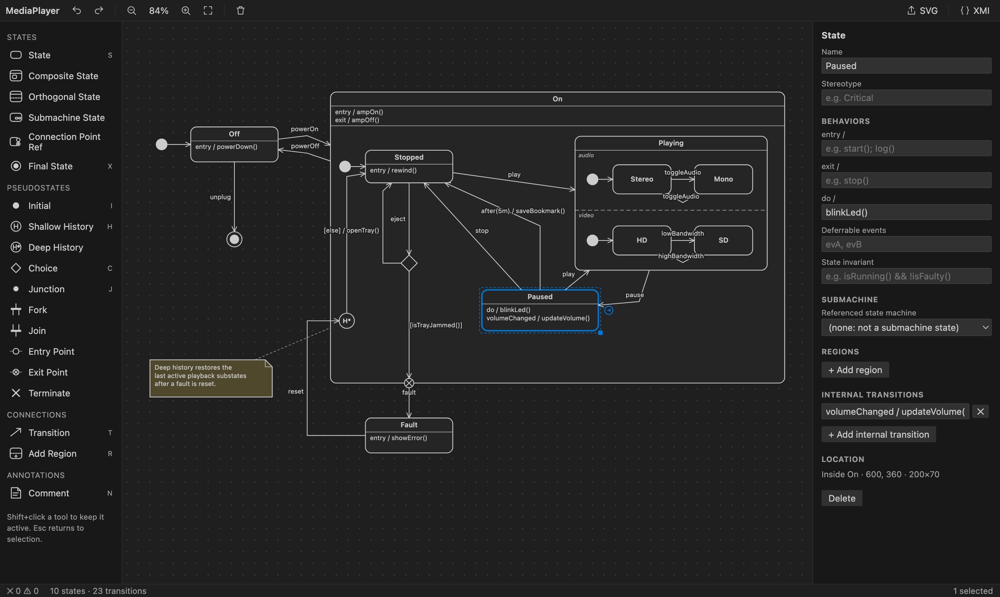
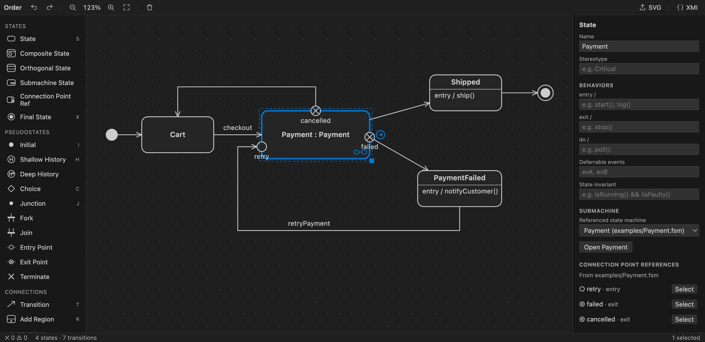
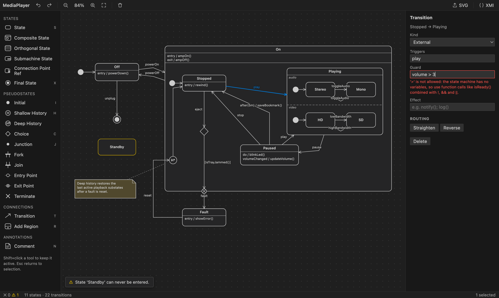

# FSM Editor — UML State Machines for VS Code

A visual editor for UML 2.5.1 state machines. Open any `*.fsm` file to get a canvas with a toolbox, a properties panel, live validation and SVG export. Files are standard XMI 2.5.1: the UML model plus its diagram layout in UML DI, in the same file.



## UML support

The editor covers UML 2.5.1 state machines: composite, orthogonal and submachine states, all pseudostates, connection point references, entry/exit/do behaviors, deferrable events, the external, local and internal transition kinds, time triggers, and protocol state machines. A validator checks the well-formedness rules as you edit.

Behaviors and conditions are argument-less function calls (`rewind(); showTime()`, `hasDisc() && !isJammed()`), and triggers are event names or `after(2s)`.

Submachine states reuse another state machine file. They're entered and left through connection point references bound to that machine's entry and exit points:



Text that breaks the rules is refused as you type, and the validator flags problems on the diagram and in VS Code's Problems panel:



See **[docs/UML-CONFORMANCE.md](docs/UML-CONFORMANCE.md)** for:
- the supported features and the text syntax;
- how to use submachines and connection point references;
- how the model and layout are stored in XMI and UML DI;
- where and why the tool deviates from UML 2.5.1;
- every validation rule;
- what the SVG export contains.

## Using the editor

- **Add elements**: click a toolbox item and then the canvas, or drag it onto the canvas. Drop inside a region to nest it. Double-click empty canvas to add a state.
- **Transitions**: select an element and drag its ⊕ handle to the target, or use the Transition tool (T). Drawing from a comment attaches the comment instead.
- **Labels**: double-click a name or transition label to edit it in place. The transition syntax is `event, after(2s) [isReady() && !isBusy()] / doIt(); log()`.
- **Routing**: double-click a transition to add a bend point, double-click a bend point to remove it, and drag labels to move them.
- **Regions**: use the Add Region tool (R) or the properties panel.
- **View**: Space+drag or middle-drag pans, Ctrl/Cmd+wheel zooms, F fits the diagram.
- **Editing**: Delete removes the selection. Ctrl/Cmd+C/X/V copies, cuts and pastes, including between diagrams. Ctrl/Cmd+D duplicates. Arrow keys nudge (Shift for 10px). Undo and redo are VS Code's own.
- **Shortcuts**: S state, X final, I initial, H history, C choice, J junction, N comment, T transition, R region, V/Esc select. Shift+click a tool to keep it active.

Commands (Command Palette → "FSM"): *New State Machine*, *Export as SVG*, *Open as XMI Text*, *Open in FSM Editor*.

## Development

```sh
npm install
npm run compile      # or: npm run watch
```

Press F5 in VS Code to launch an Extension Development Host with the `examples` folder open, then open `examples/MediaPlayer.fsm`, or `examples/Order.fsm` for a submachine with connection point references (it uses `examples/Payment.fsm`).

Package with `npm run package`, which produces a `.vsix` file.

### Layout

- `src/extension.ts`: commands and registration
- `src/fsmEditorProvider.ts`: custom text editor; syncs the document and the webview and publishes diagnostics
- `src/model.ts`: the in-memory model the diagram editor works on
- `src/xmi.ts`, `src/xml.ts`: reading and writing `.fsm` files (XMI with UML DI)
- `src/validation.ts`: UML well-formedness rules
- `media/editor.js`, `media/editor.css`: the diagram editor webview (no dependencies)
- `media/expressions.js`: grammar of behaviors, conditions and triggers, shared by the webview and the validator
- `docs/UML-CONFORMANCE.md`: supported UML features, deviations, validation rules and export mappings
